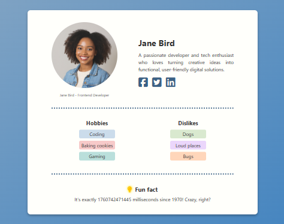

# **Profile Card**

A modern, responsive profile card built with **HTML**, **CSS**, and **Font Awesome** — designed to showcase a user’s avatar, bio, hobbies, dislikes, and even a live-updating fun fact showing the current time in milliseconds.

---

## **Features**

* User avatar with caption
* Name, bio, and social media links
* Stylish dotted dividers and gradient background
* Dynamic fun fact section displaying real-time milliseconds since 1970
* Hover effects and glowing lightbulb icon
* Fully responsive and accessible design

---

## **Built With**

* **HTML5** – Semantic structure
* **CSS3** – Styling and layout
* **Font Awesome** – Icons for social links and fun fact
* **JavaScript** – Live time functionality

---

## **Getting Started**

### Clone this repository:

```bash
git clone https://github.com/xieumar/hng-profile-card.git
```

### Open the project folder:

```bash
cd profile-card
```

---

## **How to Run the Project**

Open `index.html` directly in your browser, or use **Live Server** in VS Code for real-time updates:

```bash
npx live-server
```

---

## **How It Works**

* The JavaScript file (`index.js`) dynamically updates the `<span id="clock">` element every millisecond to show live time.
* CSS styles create a soft, friendly aesthetic with gradients, rounded elements, and hover transitions.
* Font Awesome provides a clean set of icons for visual appeal and clarity.

---

## **Preview**



---

## **Future Improvements**

* Add dark/light mode toggle
* Include more user data sections (e.g., skills, projects)
* Add animations for social links or hover effects

---

## **Author**

**Zainab Umar Ibrahim**
Frontend Developer

This project is open-source and available under the **MIT License**.


